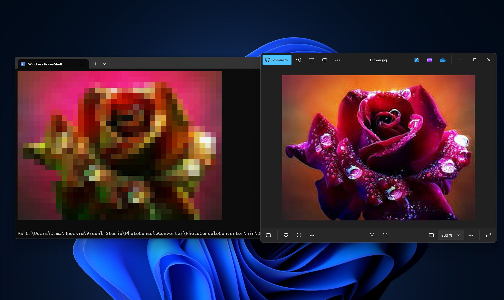
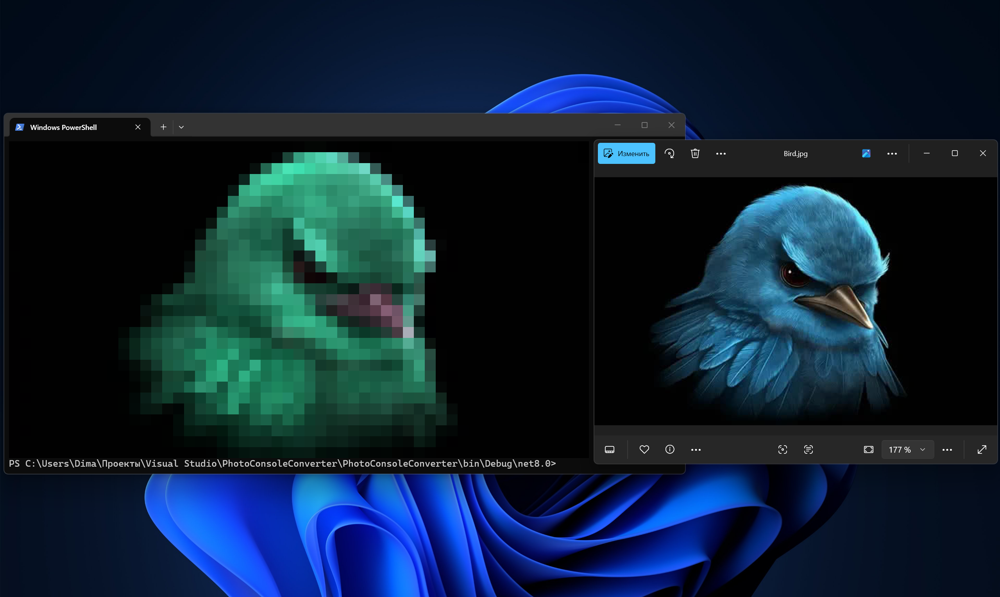

## PhotoConsoleConverter

Are you tired of the high resolution of your pictures? Well, I have a solution: PhotoConsoleConverter

**PhotoConsoleConverter** is a simple C# program that reduces the resolution of your pictures and converts them into a convenient console-friendly format.  

This project demonstrates my early exploration into image processing and working with console applications.

## Examples
 
 
